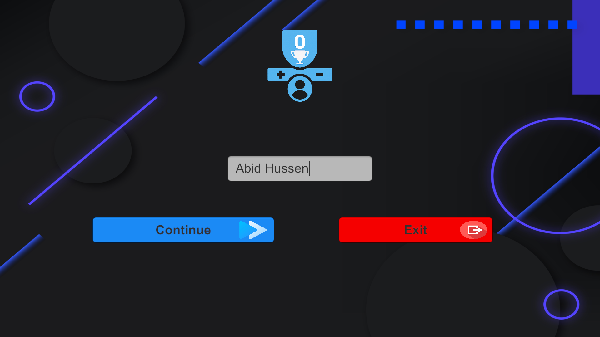
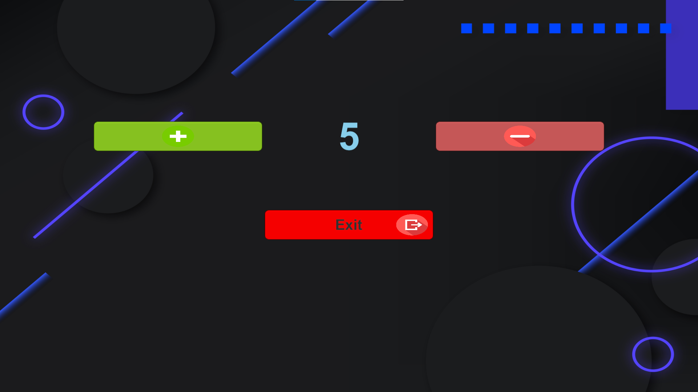

# 🕹️ SimpleCounterGame

A beginner-friendly Unity counter app game that lets players increment and decrement numbers. Includes a user-friendly UI, username tracking, and a congratulatory screen when the counter hits 10!

---

## 📸 Screenshots

| Welcome Screen | Counter Scene | Congratulations |
|----------------|---------------|-----------------|
|  |  |  |

---

## 🚀 Features

- 🔢 Increment / Decrement Counter
- 🧑 Username input saved using `PlayerPrefs`
- 🎉 Custom congratulation screen when score = 10
- 🖼️ Stylish buttons and background
- 💾 Score persists even after app closes

---

## 🛠️ Technologies Used

- Unity 6.1
- C#
- Git & Git LFS (for build release)
- GitHub Releases

---

## 📦 Download

Download the latest `.zip` from the [Releases section](https://github.com/AbiDHussen/SimpleCounterGame/releases).

---

## 🎮 How to Play

1. Open the app
2. Enter your name
3. Press `Continue`
4. Click the **+** button to increase the score
5. Reach 10 to win 🎉

---

## 📂 Folder Structure

```
SimpleCounterGame/
├── Assets/
├── Packages/
├── ProjectSettings/
├── .gitignore
├── .gitattributes
├── README.md
├── CounterAppBuild.zip (via Git LFS)
```


## 🙌 Credits

Made with ❤️ by [AbiDHussen](https://github.com/AbiDHussen)
